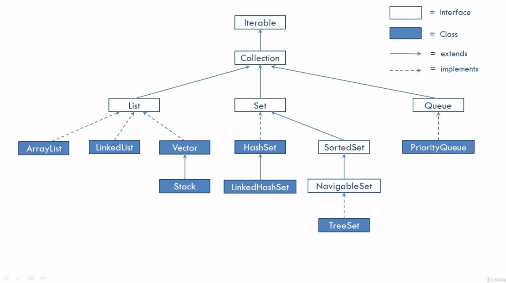

# TreeSet

Difference between TreeSet and HashSet (or LinkedHashSet)

All elements in a TreeSet are sorting in a descending order

	(Interfaces)				Iterable
									|
	(Interfaces)				Collection
									|
							-------------------------------------------------------------			
							|				 	      |				  					|
	(Interfaces)  	  	  List     				     Set							  Queue
					------------------------	  --------------						-		
					|			|			|	  |				|						|
	(Class)		ArrayList	LinkedList	Vector	HashSet		SortedSet(interface)	PriorityQueue
										|	      |				|
									Stack  LinkedHashSet  NavigableSet(Interface) 
																|
															TreeSet (class)
								   						 
__It might be necessary to implement Comparable and cComparator classes__								   						 